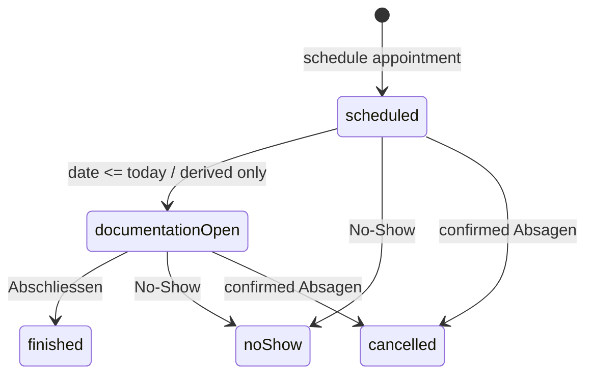

# Appointment State Machine

## Ontology

- **Patient:** person, insurance, diagnoses, quota, and longitudinal context.
- **Termin / Appointment:** scheduled calendar occurrence and lifecycle anchor.
- **Sitzung / Session:** notes plus GOP items attached to exactly one appointment.
- **GOP item:** billable line attached to a session, with its own billing status.

Appointments and sessions are always created together. There are no manual sessions without a calendar appointment.

## Stored States

Only these appointment states are stored during normal workflow:

- `scheduled`: appointment exists and has not been closed, cancelled, or marked no-show.
- `finished`: therapist clicked `Abschließen`; clinical notes remain editable.
- `noShow`: therapist marked the patient absent.
- `cancelled`: therapist cancelled the appointment; it leaves documentation and billing worklists.

## Derived State

`documentationOpen` is a display/worklist state. It is not a normal stored transition target.

It is derived only as:

```swift
appointment.status == .scheduled && appointment.isoDate <= today
```

That means a future appointment can never be actionable, and a finished appointment can never drift back to actionable just because the date is in the past.

Legacy rows that already contain `documentationOpen` may still be read for compatibility, but normal app code should not write it.

## Transitions

| From | To | Trigger | Stored? | Side effects |
| --- | --- | --- | --- | --- |
| none | `scheduled` | Therapist schedules an appointment | Yes | Create exactly one linked `SessionRecord` draft |
| `scheduled` | `documentationOpen` | Appointment date is today or earlier | No | None |
| `documentationOpen` | `finished` | Therapist clicks `Abschließen` | Yes | Set `session.isFinished = true`, set `session.finishedAt`, update appointment status |
| `scheduled` | `noShow` | Therapist clicks `No-Show` | Yes | Create default billable GOP rows if none exist |
| `documentationOpen` | `noShow` | Therapist clicks `No-Show` | Yes | Create default billable GOP rows if none exist |
| `scheduled` | `cancelled` | Therapist confirms `Absagen` | Yes | Exclude appointment from documentation and billing worklists |
| `documentationOpen` | `cancelled` | Therapist confirms `Absagen` | Yes | Exclude appointment from documentation and billing worklists |

There is no `finished -> documentationOpen` transition.

## Transition Guards

- `Abschließen` is allowed only when the derived display state is `documentationOpen`.
- `No-Show` is allowed only for `scheduled` and `documentationOpen`.
- `Absagen` is allowed only for `scheduled` and `documentationOpen`.
- `Absagen` requires confirmation before the state change is written.
- Clicking an appointment card opens the linked session; it does not change appointment state.
- Editing clinical notes never changes appointment state.
- Editing GOP rows never changes appointment state.

## State Diagram



## UI Rules

- `Aktion erforderlich` means exactly derived state `documentationOpen`.
- `Abschließen` is available only for `documentationOpen`.
- Appointment cards open the linked session when clicked; they do not need a `Dokumentieren` button.
- `No-Show` and `Absagen` are shown only for `scheduled` and `documentationOpen`.
- `Absagen` always requires a confirmation dialog.
- Future appointments are shown under `Geplante Termine`, collapsed by default to the next appointment.
- Everything that is neither future nor actionable is shown under `Weitere Termine`, collapsed by default.
- Heute, Termine, and calendar surfaces should render status via the same derived display-state function.

## Billing

Billing is not an appointment state.

GOP rows have their own billing status:

- `unbilled`
- `invoiceDraft`
- `billed`
- `voided`

The Billing tab lists unbilled GOP rows only when their appointment is stored as `finished`. Billed GOP rows are read-only; clinical notes remain editable.

## Invariants

- Every appointment has exactly one linked session.
- Every session belongs to exactly one appointment.
- `documentationOpen` is computed from appointment date plus stored `scheduled` status.
- `finished` is the only appointment state that feeds the Billing tab.
- `cancelled` never feeds documentation or billing worklists.
- Billing status belongs to GOP rows, never to appointments.
- Clinical notes remain editable in all appointment states where the session can be opened.
- GOP rows are editable only while their billing status is editable.

## Audit Log Expectations

- Scheduling writes `appointment.created` and `session.created`.
- `Abschließen` writes `session.updated` and `appointment.statusChanged`.
- `No-Show` writes `appointment.statusChanged` and, if defaults are inserted, `gop_entry.created`.
- `Absagen` writes `appointment.statusChanged`.
- Billing status changes write `gop_entry.billing_status_updated`.
